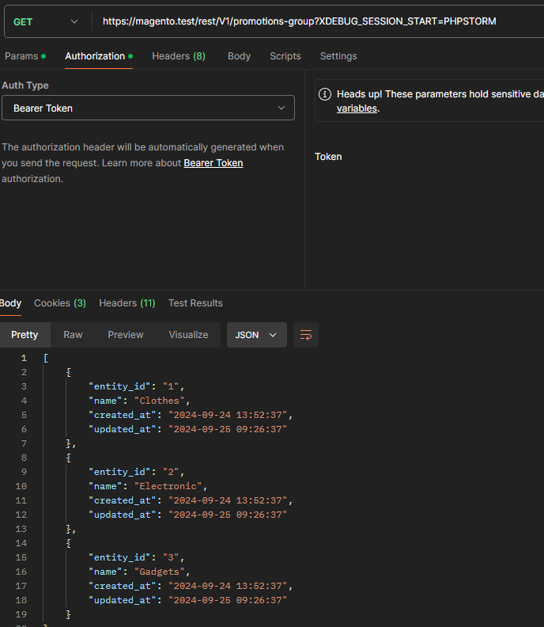
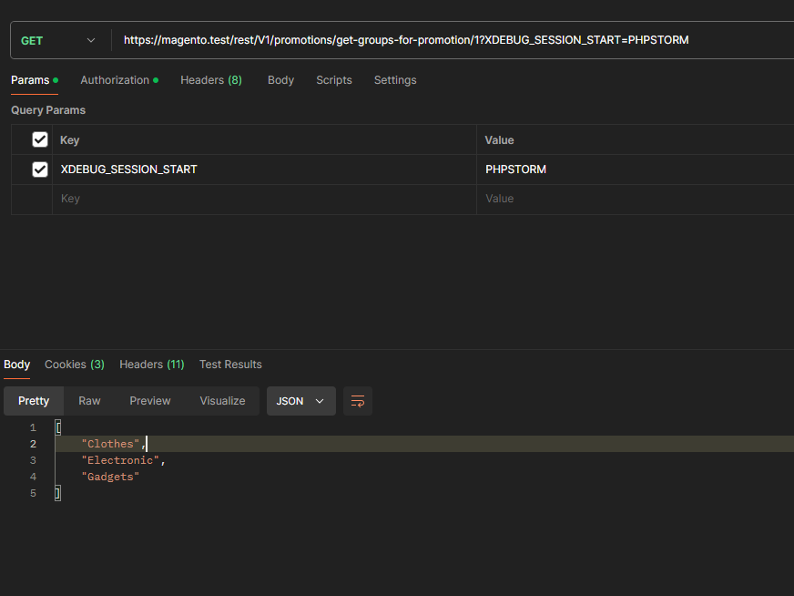

## Overview
The `Kodano_Promotions` module provides functionality for managing and applying promotions within the Magento 2 platform. This module allows for the organization of promotions into groups, with support for API-based CRUD operations. It is built using Magento's declarative schema and is easily extendable for custom use cases.

## Features
- Manage promotions and assign them to groups.
- CRUD operations for promotions via REST API.
- Utilizes Magento 2's declarative schema (`db_schema.xml`).
- Extensible and compatible with Magento 2's dependency injection system.

## Installation

### 1. Composer Installation
To install via Composer, run the following command:

```bash
composer require kodano/module-promotions

bin/magento module:enable Kodano_Promotions
bin/magento setup:upgrade
bin/magento setup:di:compile
bin/magento setup:static-content:deploy
```

## Usage

### Api
GET /rest/V1/promotions-group


GET rest/V1/promotions/get-groups-for-promotion/{x}


POST rest/V1/promotions/assign
`{
    "promotionsId":28,
    "promotionsGroupId":13
}`

